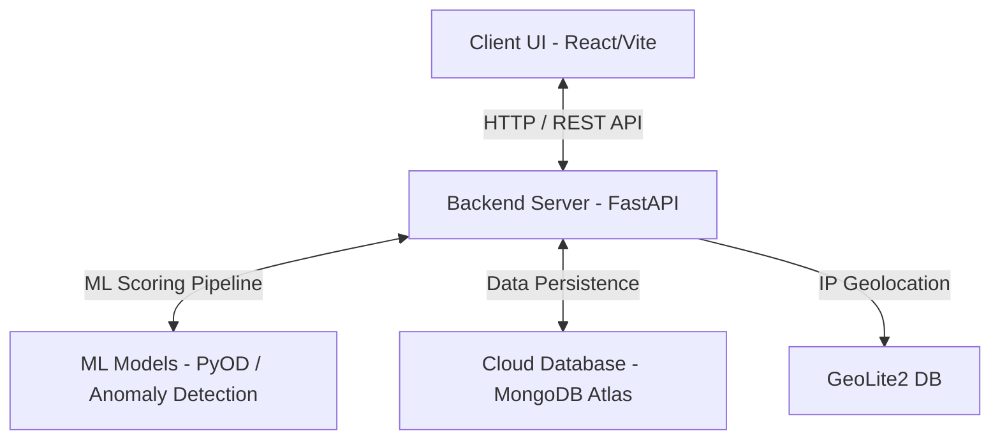

# Fraud Hunter — Enterprise Transaction Triage

Welcome to Fraud Hunter, a high-performance enterprise real-time transaction triage and fraud detection suite. This project is composed of a cutting-edge FastAPI (Python) ML-driven backend and a beautiful, high-fidelity React/Vite (TailwindCSS) frontend dashboard.

---

## Key Features

- **Real-time Triage Queue**: View flagged high-risk transactions instantly with a premium, sleek UI.
- **Machine Learning Scoring**: Transactions are run through a robust ML pipeline powered by advanced algorithms (PyOD, scikit-learn) to calculate a risk score.
- **Geographic and Behavioral Insights**: Includes country mapping with GeoLite2, IP verification, and device-matching anomaly metrics.
- **Audit Ledger**: Complete audit logging of reviewer actions to support compliance and investigation requirements.

---

## Architecture & Tech Stack



### Frontend
- **Framework**: React 19 + Vite (Ultra-fast HMR)
- **Styling**: Tailwind CSS + Custom premium aesthetics (glassmorphism, interactive animations)
- **Networking**: Axios

### Backend
- **Framework**: FastAPI (Asynchronous high-performance Python API)
- **Database**: MongoDB Atlas connected via motor (Async driver)
- **Machine Learning & Analytics**: pandas, scikit-learn, pyod (Python Outlier Detection), shap (explainability)
- **Geolocation**: geoip2 with MaxMind GeoLite2 databases

---

## How to Run the Project (Tutorial)

This guide provides step-by-step instructions to get both the backend and frontend up and running on your local machine.

### Prerequisites
Make sure you have the following installed:
1. **Node.js** (v18 or higher recommended) — [Download](https://nodejs.org/)
2. **Python 3.10+** — [Download](https://www.python.org/)
3. **MongoDB**: The backend is configured to use a managed cloud MongoDB instance out of the box, so you do not need to install MongoDB locally!

---

### Step 1: Clone and Navigate
Open your terminal and navigate to the project directory:
```bash
cd c:\Users\steve\Desktop\MPCHACK2
```

---

### Step 2: Set Up the Backend

1. **Navigate to the backend directory**:
   ```bash
   cd backend
   ```

2. **Create a virtual environment (recommended)**:
   - **Windows (PowerShell)**:
     ```powershell
     python -m venv venv
     .\venv\Scripts\Activate.ps1
     ```
   - **macOS / Linux**:
     ```bash
     python3 -m venv venv
     source venv/bin/activate
     ```

3. **Install the dependencies**:
   ```bash
   pip install -r requirements.txt
   ```

4. **Launch the Backend API Server**:
   ```bash
   uvicorn app.main:app --reload --port 8000
   ```
   The backend should now be running at [http://127.0.0.1:8000](http://127.0.0.1:8000)! You can view the interactive Swagger documentation at [http://127.0.0.1:8000/docs](http://127.0.0.1:8000/docs).

5. **(Optional) Generate & Upload Synthetic Transaction Data**:
   If your database is empty, run the custom generator script to populate it with 1,000 scored synthetic transactions:
   ```bash
   python generate_and_upload.py
   ```

---

### Step 3: Set Up the Frontend

1. **Open a new terminal window** and navigate to the frontend directory:
   ```bash
   cd c:\Users\steve\Desktop\MPCHACK2\frontend
   ```

2. **Install dependencies**:
   ```bash
   npm install
   ```

3. **Launch the Development Server**:
   ```bash
   npm run dev
   ```

4. **Access the Dashboard**:
   Open your browser and navigate to:
   [http://localhost:5173](http://localhost:5173) (or the port specified in your terminal).

---

## Project Structure

```text
MPCHACK2/
├── backend/
│   ├── app/
│   │   ├── api/          # API Route controllers
│   │   ├── database.py   # MongoDB Connection configuration
│   │   ├── main.py       # FastAPI Entry Point
│   │   ├── models/       # Pydantic schemas / DB models
│   │   └── services/     # ML pipeline, geolocation, & logic
│   ├── requirements.txt  # Python Dependencies
│   └── generate_and_upload.py # Synthetic data generator
│
└── frontend/
    ├── src/              # React files (components, views, assets)
    ├── package.json      # Node.js configuration
    ├── index.html        # App wrapper
    └── vite.config.js    # Vite dev server configuration
```

---

## Troubleshooting

### 1. PowerShell Script Execution Policy Error (Windows)
If you get an error when running `.\venv\Scripts\Activate.ps1`, run this command in your PowerShell terminal first:
```powershell
Set-ExecutionPolicy -ExecutionPolicy RemoteSigned -Scope Process
```
Then retry activating the virtual environment.

### 2. Frontend cannot reach Backend
By default, the React frontend is configured to send requests to `http://localhost:8000/api`. Ensure your backend server is running on port `8000` (which is the default for the launch command provided).

---

## Security Note
The database URI included in `app/database.py` is configured for this hackathon environment. In a production release, always use an `.env` file and keep credentials out of version control.
