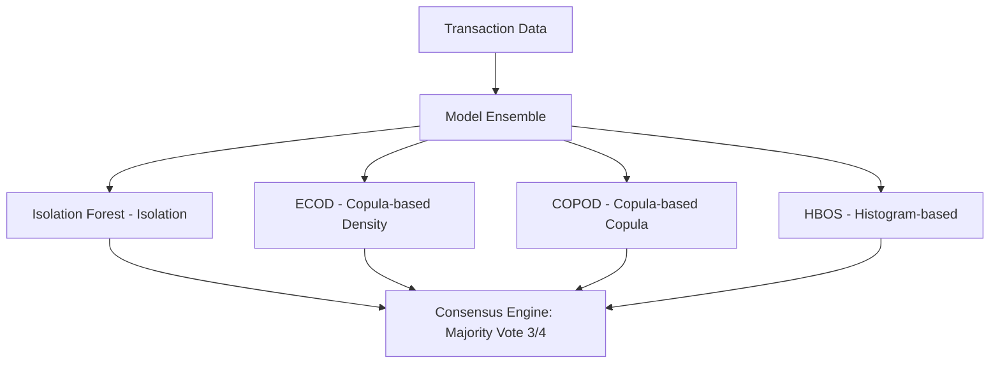

# Fraud Hunter — Implementation Choice & Architecture

Fraud Hunter is an unsupervised financial fraud detection system designed to identify emerging and previously unseen fraud patterns (zero-day attacks) without relying on historical labels. The core idea is to model normal transaction behavior and flag statistically significant deviations, addressing the limitations of supervised approaches in highly imbalanced and non-stationary financial environments. 

This document serves as a professional reference guide and educational overview of the system's design choices.

---

## Core Philosophy & Paradigm Shift

In traditional fraud detection, models are trained on historical labels (supervised learning). Fraud Hunter shifts this paradigm to **unsupervised anomaly detection** due to the unique constraints of real-world financial environments:

| Supervised Approach (Traditional) | Unsupervised Approach (Fraud Hunter) | Why the Shift? |
| :--- | :--- | :--- |
| Relies heavily on historical fraud labels | Models normal behavior; flags statistical deviations | Zero-day fraud has no historical labels to learn from. |
| Vulnerable to class imbalance (99.9% normal vs 0.1% fraud) | Stable under severe class imbalance | No training labels are needed; statistical density models natural outliers. |
| High latency if using LLMs in scoring pipeline | Lightweight scoring pipeline (<10ms inference) | LLMs are excluded from scoring due to latency/cost; reserved for explanation. |

> [!NOTE]
> **LLM Boundary**: Large Language Models (LLMs) are intentionally excluded from the core scoring pipeline because of their latency, high cost, and unsuitability for heavy-tailed numerical distributions. Instead, they are used optionally post-hoc to generate human-readable explanations for generated alerts.

---

## The Tech Stack & Pipeline Stability

The backend stack is optimized for production safety, mathematical consistency, and numerical stability:

- **Python 3.11**: Leverages modern syntax, improved performance, and stable package ecosystems.
- **PyOD Framework**: Serves as the standard anomaly detection framework to ensure API and model consistency across different algorithms.
- **RobustScaler (Data Normalization)**:
  $$\text{Scaled Value} = \frac{x - \text{median}}{\text{IQR}}$$
  *Why?* Standard scaling (using mean/variance) is highly sensitive to outliers. `RobustScaler` uses the **median** and **Interquartile Range (IQR)**, making the scaling process immune to extreme values—a critical property for financial transaction data containing heavy outliers.
- **Joblib**: Used for efficient pipeline and model serialization, ensuring fast loading and sub-millisecond execution times.

---

## The Ensemble Detection Engine

To eliminate statistical blind spots, Fraud Hunter utilizes an ensemble of **four complementary unsupervised models**. A consensus is reached via a **strict majority vote** (at least 3 out of 4 models flagging an anomaly), and scoring scales are unified using **Rank Averaging**.

### The 4 Models Explained Simply

1. **Isolation Forest (iForest)**
   - *Concept*: Isolates anomalies by randomly partitioning features. 
   - *Intuition*: Outliers require fewer splits to be isolated in a tree compared to normal points.
2. **ECOD (Empirical Cumulative Distribution Functions Anomaly Detection)**
   - *Concept*: Tail-probability estimation.
   - *Intuition*: Estimates the joint cumulative distribution to find data points that fall in extremely rare, low-density regions.
3. **COPOD (Copula-based Outlier Detection)**
   - *Concept*: Uses copulas to model multi-dimensional correlation.
   - *Intuition*: Calculates extreme tail probabilities without assuming a specific parametric distribution.
4. **HBOS (Histogram-based Outlier Score)**
   - *Concept*: Assumes feature independence and builds histograms.
   - *Intuition*: Extremely fast model that identifies outliers by looking at low-frequency bins.

---

## High-Performance Feature Engineering

Fraud Hunter engineers **35 features** grouped into **6 behavioral domains** to represent all facets of a transaction:

1. **Transaction Velocity**: Frequency of card usage in short windows (detects card testing/automated attacks).
2. **Geographic Deviation**: Distance between sequential transactions (detects impossible travel anomalies).
3. **Spending Diversity**: Variety of merchant categories visited.
4. **Channel Switching**: Alternation between online, in-person, and ATM channels.
5. **Customer Spending Profiles**: Deviation from historical mean transaction amounts.
6. **Shared-Entity Relationships**: Networks of cards sharing the same IP address or device.

> [!TIP]
> **Performance Optimization**: Temporal and sorting-based features are optimized to $O(n \log n)$ complexity using `numpy.searchsorted`. This prevents quadratic $O(n^2)$ bottlenecks, allowing the engine to scale to millions of transactions.

---

## Intentionally Excluded Design Choices

To maintain architectural focus, runtime performance, and robustness, specific paradigms were deliberately avoided:

- **Supervised Learning**: Rejected to prevent overfitting to historical patterns and to maintain capability against zero-day attacks.
- **Strict Real-Time Inference**: Swapped for high-throughput batch processing to maximize system efficiency.
- **Individual Threshold Tuning**: Replaced by a unified consensus mechanism to avoid complex multi-threshold configurations.
- **Production EDA Visualizations**: Removed from the hot-path to keep runtime overhead to a minimum.
